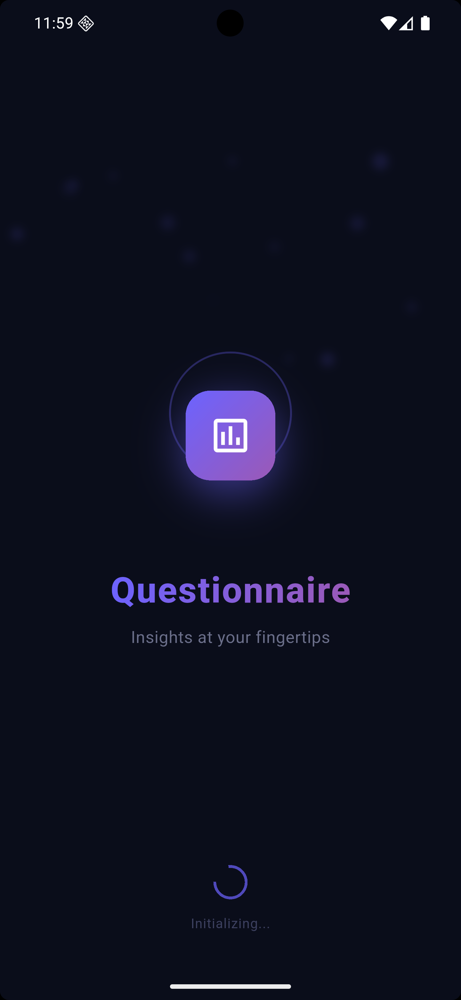
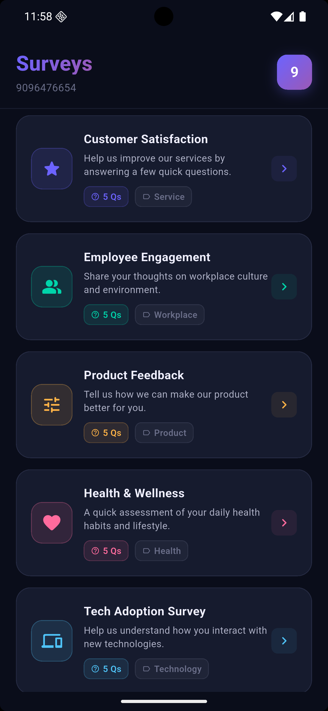
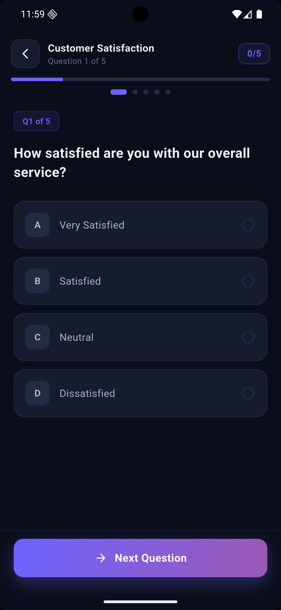
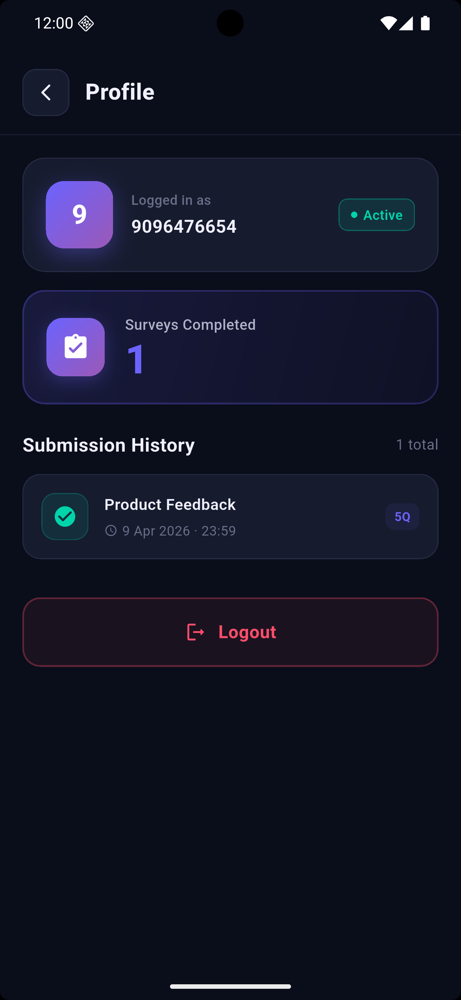

# QuickSurvey - User Feedback Collection App

A modern, feature-rich Flutter application for collecting user feedback and survey responses with offline capabilities, location tracking, and crash reporting.

## 📱 About

QuickSurvey is a mobile-first survey and questionnaire application designed to efficiently collect user feedback and responses. Built with Flutter, it provides a seamless experience on both iOS and Android platforms with robust offline support and real-time error tracking.

## ✨ Key Features

### 🔄 Offline-First Architecture
- **Hive Local Storage**: Persistent local storage for survey responses without internet connection
- Automatic synchronization when connectivity is restored
- No data loss even in offline scenarios

### 📍 Location Services
- **Geolocator Integration**: Capture user location data with surveys (with proper permissions)
- Permission management with fallback handling
- Location-based insights for survey responses

### 🚀 Performance & Stability
- **Firebase Crashlytics Integration**: Real-time error tracking and crash reporting
- Firebase Core for robust backend infrastructure
- Automatic error zone handling for comprehensive crash coverage

### 🎨 User Experience
- **Responsive Design**: Flutter ScreenUtil for pixel-perfect layouts across all devices
- Portrait-first UX with proper orientation locking
- Material Design 3 principles throughout
- Transparent status bar with adaptive styling

### 🧭 Navigation & State Management
- **GetX Framework**: Lightweight yet powerful state management and navigation
- Streamlined routing system
- Efficient dependency injection

### 📦 Architecture
- **Clean Architecture Pattern**: Well-organized code structure with separation of concerns
- Feature-based folder organization
- Reusable core components and services
- Scalable and maintainable codebase

## 🛠️ Technology Stack

### Core
- **Framework**: Flutter 3.11.1+
- **Language**: Dart 3.11.1+
- **Build Tools**: Build Runner, Flutter Launcher Icons

### State Management & Navigation
- **GetX** (v4.6.6): State management, route management, and dependency injection

### Data & Storage
- **Hive** (v2.2.3): NoSQL local database for offline responses
- **Hive Flutter** (v1.1.0): Flutter integration for Hive

### Backend & Cloud
- **Firebase Core** (v4.6.0): Backend infrastructure
- **Firebase Crashlytics** (v5.1.0): Error tracking and crash reporting

### Device Features
- **Geolocator** (v11.0.0): GPS and location services
- **Permission Handler** (v11.3.1): Native permission management

### UI & Display
- **Flutter ScreenUtil** (v5.9.0): Responsive design and scaling
- **Flutter Launcher Icons** (v0.13.1): App icon generation

## 📸 Screenshots

### App Logo


### App Screenshots
<p align="center">
  
  
  
  
</p>

## 🚀 Getting Started

### Prerequisites
- Flutter SDK 3.11.1 or higher
- Dart 3.11.1 or higher
- iOS 11.0+ or Android 5.0+

### Installation

1. **Clone the repository**
   ```bash
   git clone <repository-url>
   cd quicksurvey
   ```

2. **Install dependencies**
   ```bash
   flutter pub get
   ```

3. **Run code generation**
   ```bash
   flutter pub run build_runner build
   ```

4. **Run the app**
   ```bash
   flutter run
   ```

## 📋 Project Structure

```
lib/
├── core/
│   ├── constants/          # App constants
│   ├── router/             # Navigation routes
│   ├── services/           # Firebase, Local Storage, Crashlytics
│   ├── theme/              # App theming
│   └── widgets/            # Reusable widgets
├── features/               # Feature modules
│   └── [feature folders]
└── firebase_options.dart   # Firebase configuration
```

## 🔧 Configuration

### Firebase Setup
Update `lib/firebase_options.dart` with your Firebase project credentials for both iOS and Android platforms.

### App Icons
App icons are automatically generated using Flutter Launcher Icons. Update `pubspec.yaml` to customize icon paths.

## 🧪 Development

### Build Variants
```bash
# Development
flutter run

# Release
flutter run --release

# Profiling
flutter run --profile
```

### Code Generation
```bash
flutter pub run build_runner build --delete-conflicting-outputs
```

## 📝 License

This project is proprietary and confidential.

## 👥 Contributors

Developed with Flutter best practices and clean architecture principles.

---

**Version**: 0.1.0  
**Last Updated**: April 2026
